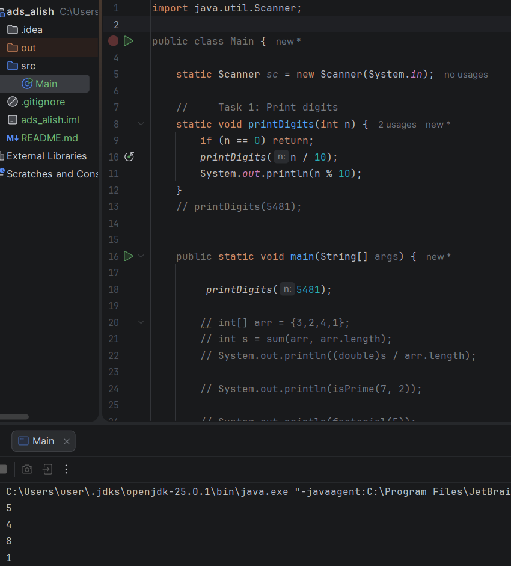
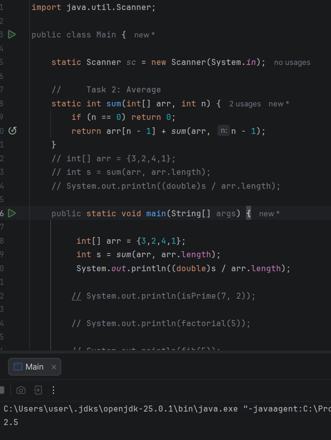
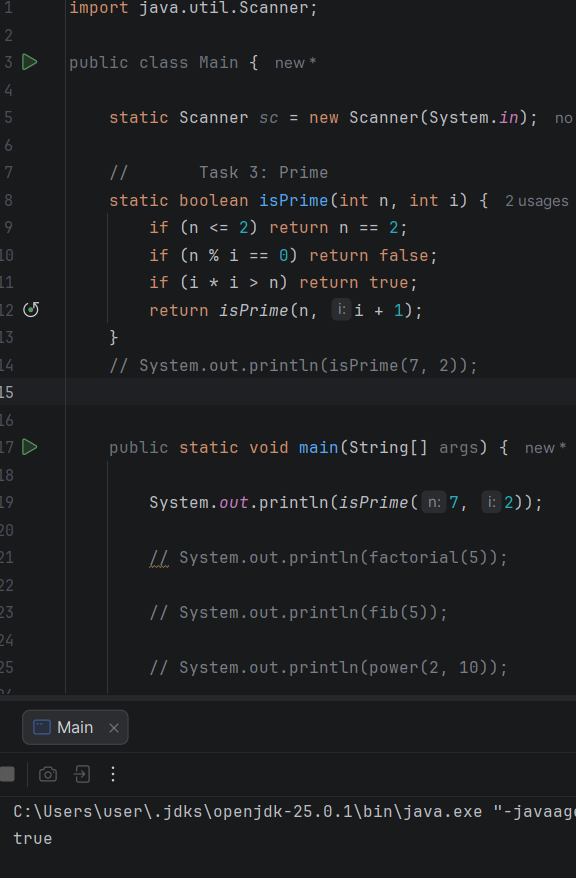
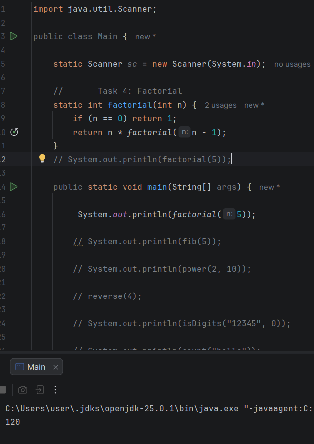
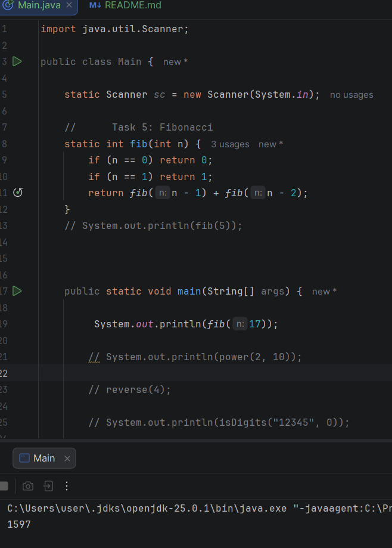
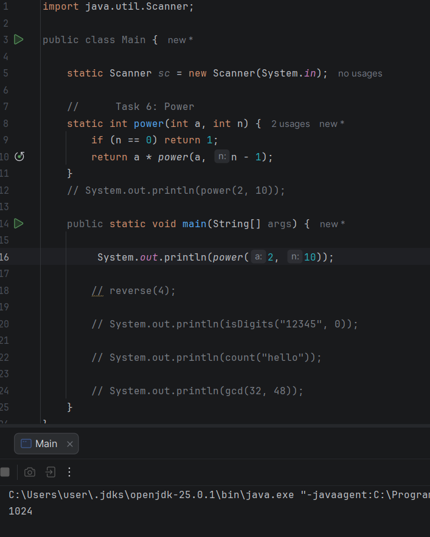
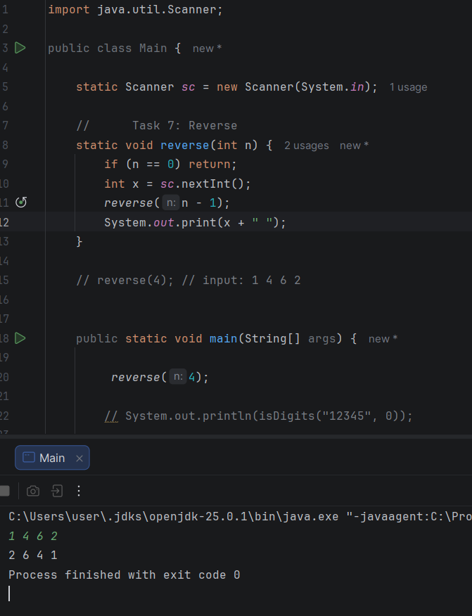
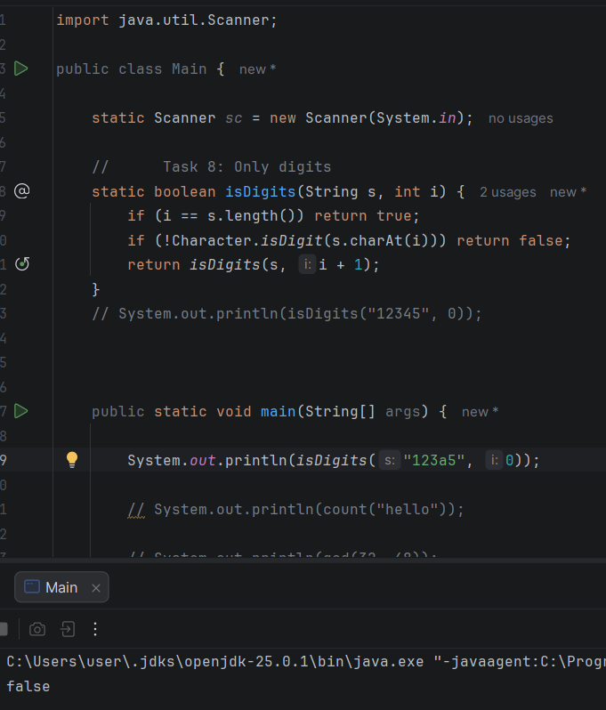
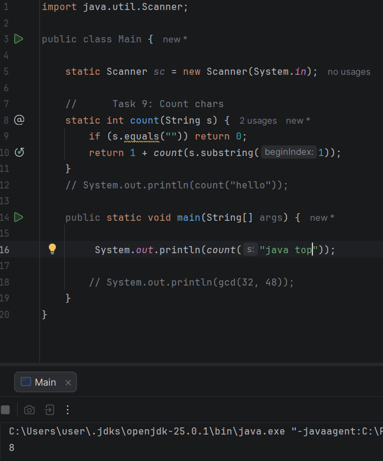
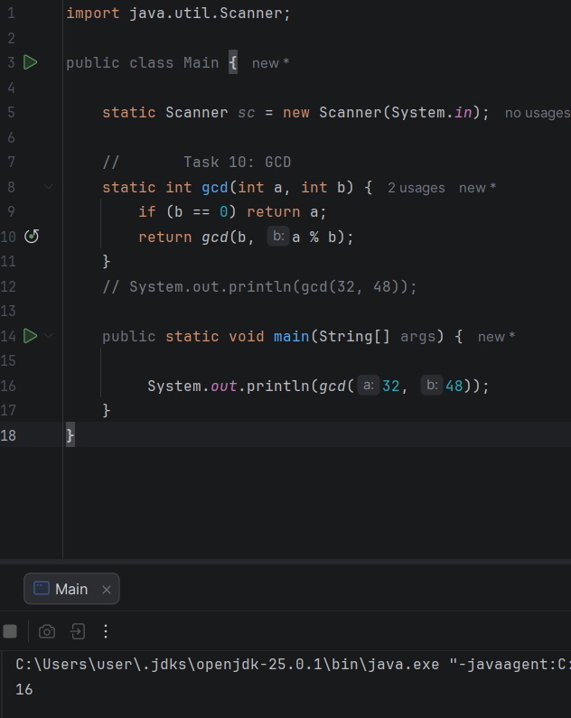

# Assignment 1 - Recursion

## Student
Name: Alisher Eskermes  
Group: IT-2501

## Summary
In this assignment, I implemented 10 different problems using recursion in Java.
The tasks included working with numbers, arrays, and strings.

Through this assignment, I learned:

how recursion works,
how to define base cases,
how to replace loops with recursive calls.

## Tasks

### Task 1: Print digits

### Task 2: Average

### Task 3: isPrime

### Task 4: Factorial

### Task 5: Fibonacci

### Task 6: Power

### Task 7: Reverse

### Task 8: Only digits

### Task 9: Count

### Task 10: GCD

